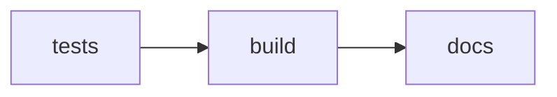

# Trace selection GUI 

*Simplified trace selection and labelling GUI*

Uses `TimeTraceTools` to handle `TimeTrace` and `Experiment` data. 

🌐 For full details, visit the site:
[Open the Docs](https://your-mkdocs-site.com)


Basic workflow: 

* Load raw experiment data (magnetic-tweezers, TIRF (?))
* View the traces
* tag traces with specified label
* select a portion of the trace and tag that portion with a specified label 
* Write the labels 

Once done, you can now use `TimeTraceTools` to write your entire data processing pipeline: 
* Load the labels 
* Perform a `SelectTracesByLabel` and/or `SelectSections` operations. 
* Perform additional operations... 


## Installation 

### MacOS / Linux 
Download the executable from [enter link later]()

### Windows 
Download the executable from [enter link later]()

### For Development
Clone this repository and use `uv` to manage dependencies. 

```zsh
# todo: adjust later 
git clone ....
cd ... 
uv pip sync -d 
...
```


# GitLab actions 
When you push to the `main` branch the following will happen automatically: 



**tests:**
* unit tests: Assert basic functionality is not hampered with. 
* Only continue when you pass 

**build:** 
* create an executable. Users do not need to worry about having Python configured. 

**docs:** 
* builds the MkDocs webpage and deploys it on GitLab pages 


## Repository layout 
```shell
    .
    ├── app                 # (Python) source code 
    │   ├── __init__.py     
    │   ├── core                    # cross-cutting concerns (may be shared across the application)
    │   ├── main_app                # Main application MVC
    │   ├── section_label_assignment # component MVC 
    │   └── ...
    ├── tests                   # (Unit) tests (using pytest). Follows the same directory layout as the source code. 
    │   ├── core                    
    │   ├── main_app
    │   ├── section_label_assignment
    │   └── ... 
    ├── main.py                 # Main entry-point of code 
    ├── config.json             # (Default) user settings 
    ├── scripts                 # Additional (Python) scripts not part of the main application 
    ├── docs                    # MkDocs website contents (markdown files)
    ├── mkdocs.yml              # MkDocs website: configuration 
    ├── htmlcov                 # Pytest coverage report
    ├── .vscode                 # IDE workspace settings (VSCode)    
    ├── .gitignore                              
    ├── README.md         
    ├── ci                      # GitLab-CI scripts          
    ├── gitlab-ci.yml           # GitLab-CI main job configuration         
    ├── .venv                   # Python environment (UV)                  
    ├── pyproject.toml          # Python project dependencies and settings (UV)                    
    └── uv.lock                  

```