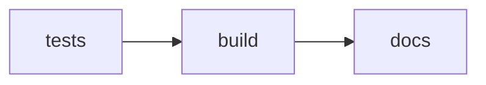

# Trace selection GUI 

*Simplified trace selection and labelling GUI*

Uses `TimeTraceTools` to handle `TimeTrace` and `Experiment` data. 

Basic workflow: 

* Load raw experiment data (magnetic-tweezers, TIRF (?))
* View the traces
* tag traces with specified label
* select a portion of the trace and tag that portion with a specified label 
* Write the labels 

Once done, you can now use `TimeTraceTools` to write your entire data processing pipeline: 
* Load the labels 
* Perform a `SelectTracesByLabel` and/or `SelectSections` operations. 
* Perform additional operations... 


## Installation 

### MacOS / Linux 
Download the executable from [enter link later]()

### Windows 
Download the executable from [enter link later]()

### For Development
Clone this repository and use `uv` to manage dependencies. 

```zsh
# todo: adjust later 
git clone ....
cd ... 
uv pip sync -d 
...
```


# GitLab actions 
When you push to the `main` branch the following will happen automatically: 



**tests:**
* unit tests: Assert basic functionality is not hampered with. 
* Only continue when you pass 

**build:** 
* create an executable. Users do not need to worry about having Python configured. 

**docs:** 
* builds the MkDocs webpage and deploys it on GitLab pages 


## design notes 
To make this code clean and easy to extend: 
* It does not do too much: Only viewing traces and tagging (sections / a set of time frames) with custom labels. 
* Separate the user facing parts from the operations done: Allows one to swap the GUI building package if one so desires. 
* Integrated unit tests. 
* A widget / smaller app that handles adding/removing string items (labels) to a list: Can be used as standalone app --> Can be used in some other setting easily. 

