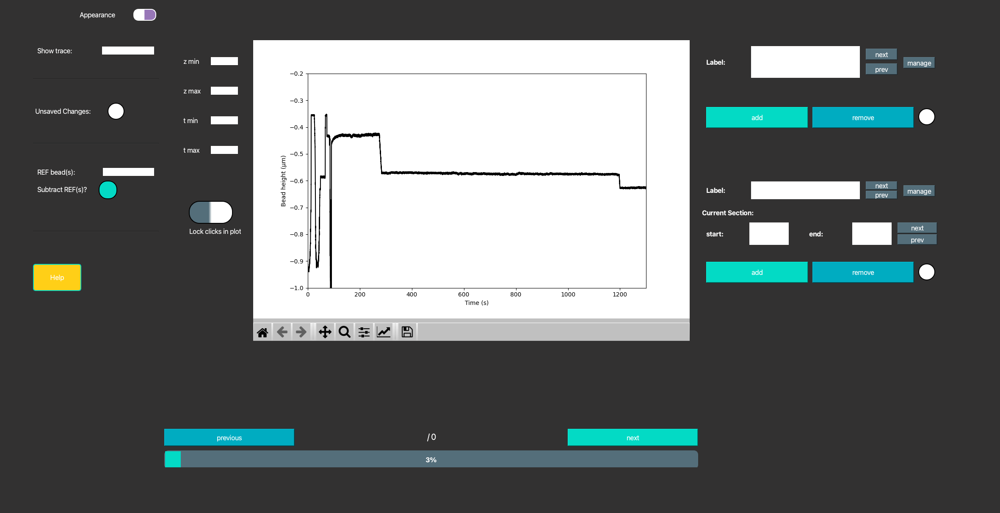
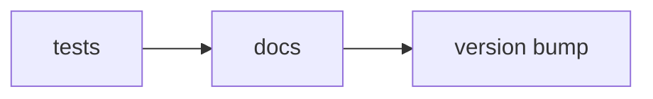
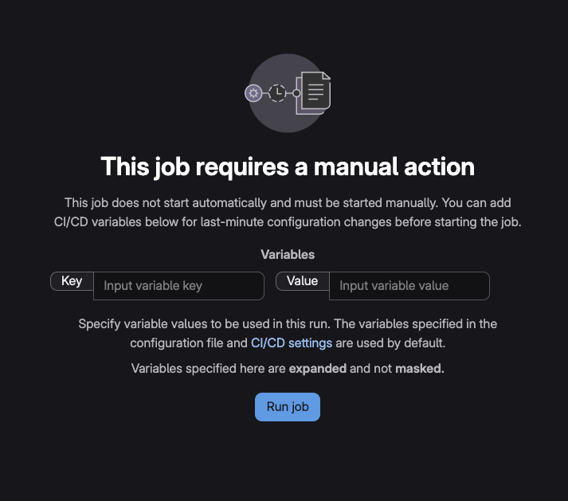

# 🔬 Time-trace (pre-)processing GUI 
> *A re-imagined code for a GUI that is easy (easier) to maintain and expand.*

<span style="font-size: 16pt;">

&#x1F389; **Hooray! You successfully performed your experiment!**


&#x1F615;  Now you need to process your data. Where to start?
</span>

--- 

🌐 Uses  [`TimeTraceTools`](https://time-trace-tools-3ff349.gitlab.io/)

🌐 For full details, visit the site:
[Open the Docs](https://trace-selection-gui-8a8ed0.gitlab.io )




--- 

<div style="border:2px dotted #0eceaeff; padding:10px; border-radius:6px">

&#x1F4A1; **Use this GUI for the first processing steps**
---
&#x0031;&#xFE0F;&#x20E3; **Display all the traces.**

*Perform basic background / reference subtraction and plot the raw data.*


&#x0032;&#xFE0F;&#x20E3; **Categorize the traces.** 

*Label (a subset) of the time-traces using your custom set of categories/labels. (i.e. 'shows event', 'shows multiple events', 'discard', 'use for nice figure', etc.)*

&#x0033;&#xFE0F;&#x20E3; **Zoom in on particular time-windows.**

*Select a particular section in (some of) the time-traces and give those sections their own labels. (i.e 'protein activity', 'quality check', etc.)* 
</div>  
<br>
<span style="font-size: 16pt;">

&#x1F44D; Now you have done the tedious manual inspection & selection required.  


&#x1F680; Further process your data using [`TimeTraceTools`](https://time-trace-tools-3ff349.gitlab.io/). 
</span>

## &#x1F4BE; Installation 

1. Clone this repository:
```zsh
git clone git@gitlab.com:DulinlabVU/trace_selection_gui.git
cd trace_selection_gui
```

2. Run `main.py` and let  `uv` take care of creating a virtual environment with all the dependencies: 
```zsh
uv run python main.py
```


### For Development
Developers need to install additional dependencies (such as `pytest` for unit tests and `mkdocs` for adjusting the documentation website).

```zsh
# clone this repository
git clone git@gitlab.com:DulinlabVU/trace_selection_gui.git
cd trace_selection_gui

# create virtual environment including developer dependencies.
uv sync --dev  
```


# &#x1F501; GitLab actions 
When you push to the `main` branch the following will happen automatically: 



**🧪 tests (&#x2705; success required)**
* unit tests: Assert crucial functionality is not hampered with. 
* Only continue when you pass 


**&#x1F310; docs (&#x2705; success required)** 
* builds the MkDocs webpage 
* deploys it on GitLab pages 
* only continue upon success 

**&#x1F3F7; version bump (&#x1F464; manual trigger)**
* On GitLab/GitHub manually enter the bump (major, minor, or patch)
* Bumps the package version in `pyproject.toml` (mainly for documentation purposes)
* Creates a git tag with the new version and pushes this to the remote. 

**NOTE: To initiate the version bump, click on the job in the pipeline. You will see the following screen. Enter `VERSION_TYPE` as the key and any of 'major', 'minor', or 'patch' as the value. This specifies how you want to bump the version.**




**NOTE 2: After doing this, you probably want to `git pull origin main` in order to have the updated `pyproject.toml` with the bumped version on your local repository.** 
