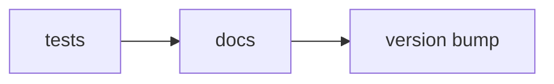

# 🔬 Time-trace (pre-)processing GUI 

> **A re-imagined code for a GUI that is easy (easier) to maintain and expand.**

🌐 Uses  [`TimeTraceTools`](https://time-trace-tools-3ff349.gitlab.io/)

🌐 For full details, visit the site:
[Open the Docs](https://your-mkdocs-site.com)


&#x1F389; Hooray! You successfully performed your experiment!

---
&#x1F615;  Now you need to process your data. Where to start?

---
&#x1F4A1; This GUI helps you doing the most common pre-processing steps for *any* kind of time-trace data (especially those typical in single-molecule biophysics experiments).

---
&#x0031;&#xFE0F;&#x20E3; **Display all the traces.**

*Perform basic background / reference subtraction and plot the raw data.*


&#x0032;&#xFE0F;&#x20E3; **Categorize the traces.** 

*Label (a subset) of the time-traces using your custom set of categories/labels. (i.e. 'shows event', 'shows multiple events', 'discard', 'use for nice figure', etc.)*

&#x0033;&#xFE0F;&#x20E3; **Zoom in on particular time-windows.**

*Select a particular section in (some of) the time-traces and give those sections their own labels. (i.e 'protein activity', 'quality check', etc.)* 

---
&#x1F44D; Now you have done the tedious manual inspection & selection required.

&#x1F680; This GUI works with the data structures defined in  [`TimeTraceTools`](https://time-trace-tools-3ff349.gitlab.io/). This means writing your custom post-processing/analysis pipelines will become a breeze!


## Installation 

1. Clone this repository:
```zsh
git clone git@gitlab.com:DulinlabVU/trace_selection_gui.git
cd trace_selection_gui
```

2. Run `main.py` and let  `uv` take care of creating a virtual environment with all the dependencies: 
```zsh
uv run python main.py
```


### For Development
Developers need to install additional dependencies (such as `pytest` for unit tests and `mkdocs` for adjusting the documentation website).

```zsh
# clone this repository
git clone git@gitlab.com:DulinlabVU/trace_selection_gui.git
cd trace_selection_gui

# create virtual environment including developer dependencies.
uv sync --dev  
```


# GitLab actions 
When you push to the `main` branch the following will happen automatically: 



**tests:**
* unit tests: Assert crucial functionality is not hampered with. 
* Only continue when you pass 

<!-- **build:** 
* build and deploy the websi -->

**docs:** 
* builds the MkDocs webpage 
* deploys it on GitLab pages 
* only continue upon success 

**version bump**
* On GitLab/GitHub manually enter the bump (major, minor, or patch)
* Bumps the package version in `pyproject.toml` (mainly for documentation purposes)
* Creates a git tag with the new version and pushes this to the remote. 

